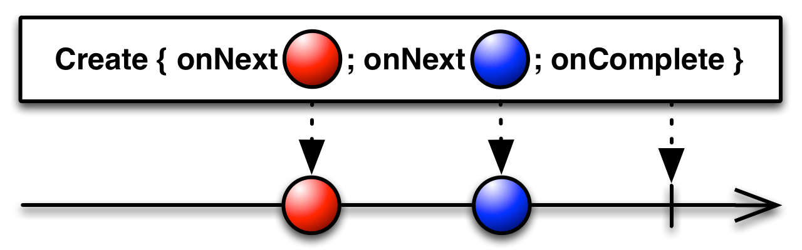

# ActionInRxJava

学习RxJava主要先了解以下几个概念

我们使用RxJava3    

http://reactivex.io/documentation/operators.html#creating

## 第一部分 Observable被观察者

创建被观察者有如下方法：

### 1. create



create an Observable from scratch by calling observer methods programmatically

通过调用观察者方法从头创建Observable。

```Java
Observable.create(new Observable.OnSubscribe<Integer>() {
    @Override
    public void call(Subscriber<? super Integer> observer) {
        try {
            if (!observer.isUnsubscribed()) {
                for (int i = 1; i < 5; i++) {
                    observer.onNext(i);
                }
                observer.onCompleted();
            }
        } catch (Exception e) {
            observer.onError(e);
        }
    }
 } ).subscribe(new Subscriber<Integer>() {
        @Override
        public void onNext(Integer item) {
            System.out.println("Next: " + item);
        }

        @Override
        public void onError(Throwable error) {
            System.err.println("Error: " + error.getMessage());
        }

        @Override
        public void onCompleted() {
            System.out.println("Sequence complete.");
        }
    });
```

以上是RxJava1提供的代码示例，create内部的是被观察者，在其call方法内部调用传入的观察者的onNext、onError、onComplete回调方法来将对应事件发送给观察者。subscribe内部的是观察者对象的实现，主要实现前面三个回调方法。这样的实现方案有个弊端，不论观察者是否关心全部回调方法，观察者必须实现。而且onComplete和onError其实只会有一个方法会被回调。现实情况可能我们只关心onNext+onError，甚至只关心onNext。 从RxJava2开始，create方法的设计更灵活，可以指定要监听哪些事件。

```java
 Observable.create(new ObservableOnSubscribe<String>() {
            @Override
            public void subscribe(@NonNull ObservableEmitter<String> emitter) throws Throwable {
                try {
                    for (int i = 0; i < 10; i++) {
                        if (!emitter.isDisposed()) {
                            emitter.onNext(i + "测试create");
                        }
                    }
                } catch (Exception e) {
                    emitter.onError(e);
                }
                emitter.onComplete();
            }
        }).subscribe(new Consumer<String>() {
            @Override
            public void accept(String s) throws Throwable {
                System.out.println("onNext:" + s);
            }
        }, new Consumer<Throwable>() {
            @Override
            public void accept(Throwable throwable) throws Throwable {
                System.out.println("onError:" + throwable.getMessage());
            }
        }, new Action() {
            @Override
            public void run() throws Throwable {
                System.out.println("onComplete:");
            }
        });
```

以上就是RxJava3中create的用法，create中传入的是一个ObservableOnSubscribe对象，其中emitter 扮演了之前observer的角色，用于发射事件。subscribe方法中传递的是两个Consumer对象和一个Action对象，分别对应onNext、onError、onComplete。 从代码长度上来看好像和之前一样繁琐，但RxJava3支持Java 8，我们可以基于Java8的Lambda表达式特性来优化方法调用过程中的匿名内部类。

```java
private static void testCreate1() {
        Observable.create(emitter -> {
            try {
                for (int i = 0; i < 10; i++) {
                    if (!emitter.isDisposed()) {
                        emitter.onNext(i + "测试create");
                    }
                }
            } catch (Exception e) {
                emitter.onError(e);
            }
            emitter.onComplete();
        }).subscribe(
                s -> System.out.println("onNext:" + s),
                throwable -> System.out.println("onError:" + throwable.getMessage()),
                ()-> System.out.println("onComplete:")
        );
    }
```

是不是瞬间感觉少了很多模板代码，代码量减少一半。如果观察者不关心异常事件，我们可以只订阅onNext事件，代码如下：

```java
private static void testCreate2() {
        Observable.create(emitter -> {
            for (int i = 0; i < 10; i++) {
                if (!emitter.isDisposed()) {
                    emitter.onNext(i + "测试create");
                }
            }
        }).subscribe(s -> System.out.println("onNext:" + s));
    }
```

### 2. defer


do not create the Observable until the observer subscribes, and create a fresh Observable for each observer

defer是推迟和延期的意思，deffer延期创建被观察者对象，会在subscribe方法调用的时候创建被观察者对象，每次订阅都会创建新的被观察者对象。

上面图片中方框内的是事件发送流，非方框的是事件接收流，可以看出第一个观察者接收了红色事件队列，被观察者已经complete了。第二个观察者订阅的已经是绿色事件流了。

```java
private static void testDefer() {
        List<String> arrayList = new ArrayList<>();
        for (int i = 0; i < 10; i++) {
            arrayList.add(i + "defer item");
        }
        //创建observable
        Observable<String> observable = Observable.defer(new Supplier<ObservableSource<? extends String>>() {
            @Override
            public ObservableSource<? extends String> get() throws Throwable {
                System.out.println(System.currentTimeMillis()+" create Observable" );
                return new ObservableSource<String>() {
                    @Override
                    public void subscribe(@NonNull Observer<? super String> observer) {
                        for (String item : arrayList) {
                            observer.onNext(item);
                        }
                        observer.onComplete();
                    }
                };
            }
        });

        //处理数据时间
        for (int i = 10; i < 20; i++) {
            try {
                Thread.sleep(1000);
                arrayList.add(i + "defer item");
            } catch (InterruptedException e) {
                e.printStackTrace();
            }
        }

        //开始订阅
        System.out.println(System.currentTimeMillis()+" start subscribe" );
        observable.subscribe(new Consumer<String>() {
            @Override
            public void accept(String s) throws Throwable {
                System.out.println(System.currentTimeMillis() + " 收到事件:" + s);
            }
        });
    }
```

上面的代码中虽然创建被观察者的代码在前，但其get方法直到底下subscribe运行之后才执行 。而且 每次订阅都会由get方法创建新的ObservableSource实例。

同样我们使用Lambda表达式优化一下代码，可以精简结构。

```java
 private static void testDefer1() {
        List<String> arrayList = new ArrayList<>();
        for (int i = 0; i < 10; i++) {
            arrayList.add(i + "defer item");
        }
        //创建observable
        Observable<String> observable = Observable.defer(() -> {
            System.out.println(System.currentTimeMillis() + " create Observable");
            return observer -> arrayList.forEach(item -> observer.onNext(item));
        });
        //处理数据时间
        for (int i = 10; i < 20; i++) {
            try {
                Thread.sleep(1000);
                arrayList.add(i + "defer item");
            } catch (InterruptedException e) {
                e.printStackTrace();
            }
        }
        //开始订阅
        System.out.println(System.currentTimeMillis() + " start subscribe");
        observable.subscribe(s ->  System.out.println(System.currentTimeMillis() + " 收到事件:" + s));
    }
```

通过以上代码可以将被观察者的部分和观察者部分精简到三行，


