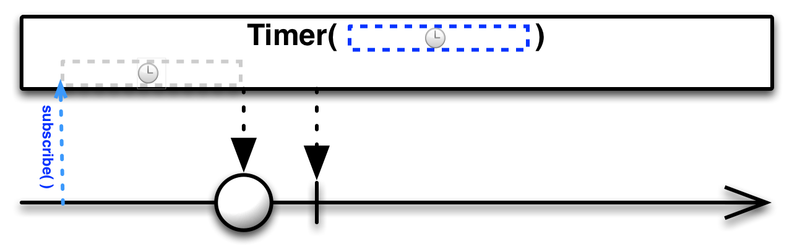
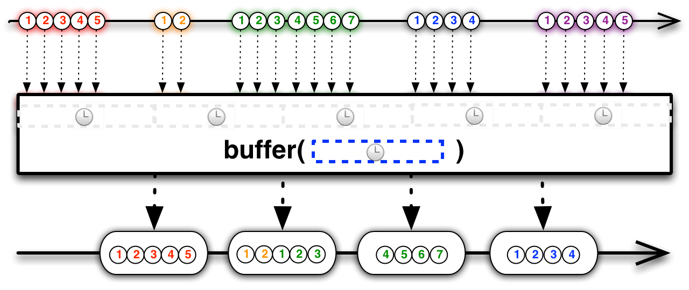
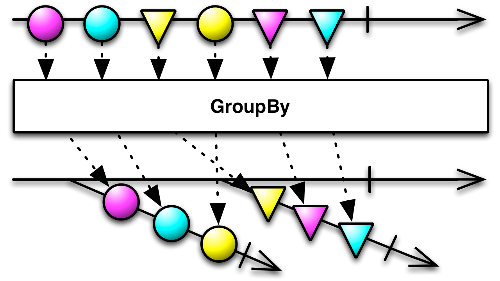
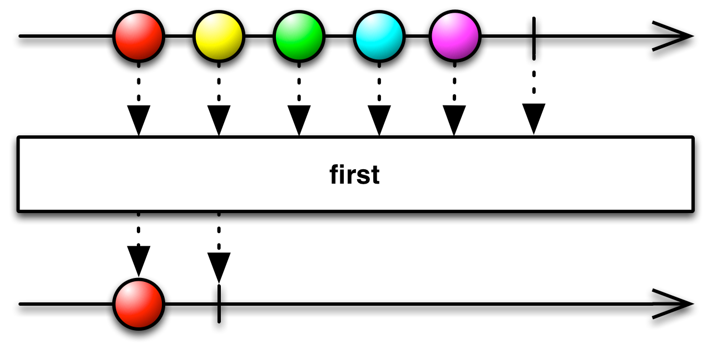
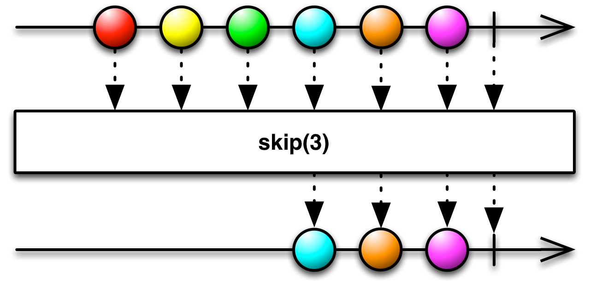
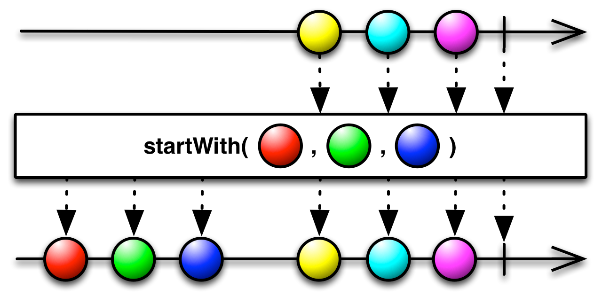

ActionInRxJava

学习RxJava主要先了解以下几个概念

我们使用RxJava3    

http://reactivex.io/documentation/operators.html#creating

了解了具体功能，或许可以看下以下应用方式：

https://github.com/kaushikgopal/RxJava-Android-Samples

https://www.jianshu.com/p/c935d0860186

https://www.jianshu.com/p/fd82d18994ce

https://www.runoob.com/w3cnote/android-tutorial-end.html

https://www.jianshu.com/p/ee1f0d21a856


## 第一部分 创建Observable

创建被观察者有如下方法：

### 1. create


create an Observable from scratch by calling observer methods programmatically

通过调用观察者方法从头创建Observable。

```Java
Observable.create(new Observable.OnSubscribe<Integer>() {
    @Override
    public void call(Subscriber<? super Integer> observer) {
        try {
            if (!observer.isUnsubscribed()) {
                for (int i = 1; i < 5; i++) {
                    observer.onNext(i);
                }
                observer.onCompleted();
            }
        } catch (Exception e) {
            observer.onError(e);
        }
    }
 } ).subscribe(new Subscriber<Integer>() {
        @Override
        public void onNext(Integer item) {
            System.out.println("Next: " + item);
        }

        @Override
        public void onError(Throwable error) {
            System.err.println("Error: " + error.getMessage());
        }

        @Override
        public void onCompleted() {
            System.out.println("Sequence complete.");
        }
    });
```

以上是RxJava1提供的代码示例，create内部的是被观察者，在其call方法内部调用传入的观察者的onNext、onError、onComplete回调方法来将对应事件发送给观察者。subscribe内部的是观察者对象的实现，主要实现前面三个回调方法。这样的实现方案有个弊端，不论观察者是否关心全部回调方法，观察者必须实现。而且onComplete和onError其实只会有一个方法会被回调。现实情况可能我们只关心onNext+onError，甚至只关心onNext。 从RxJava2开始，create方法的设计更灵活，可以指定要监听哪些事件。

```java
 Observable.create(new ObservableOnSubscribe<String>() {
            @Override
            public void subscribe(@NonNull ObservableEmitter<String> emitter) throws Throwable {
                try {
                    for (int i = 0; i < 10; i++) {
                        if (!emitter.isDisposed()) {
                            emitter.onNext(i + "测试create");
                        }
                    }
                } catch (Exception e) {
                    emitter.onError(e);
                }
                emitter.onComplete();
            }
        }).subscribe(new Consumer<String>() {
            @Override
            public void accept(String s) throws Throwable {
                System.out.println("onNext:" + s);
            }
        }, new Consumer<Throwable>() {
            @Override
            public void accept(Throwable throwable) throws Throwable {
                System.out.println("onError:" + throwable.getMessage());
            }
        }, new Action() {
            @Override
            public void run() throws Throwable {
                System.out.println("onComplete:");
            }
        });
```

以上就是RxJava3中create的用法，create中传入的是一个ObservableOnSubscribe对象，其中emitter 扮演了之前observer的角色，用于发射事件。subscribe方法中传递的是两个Consumer对象和一个Action对象，分别对应onNext、onError、onComplete。 从代码长度上来看好像和之前一样繁琐，但RxJava3支持Java 8，我们可以基于Java8的Lambda表达式特性来优化方法调用过程中的匿名内部类。

```java
private static void testCreate1() {
        Observable.create(emitter -> {
            try {
                for (int i = 0; i < 10; i++) {
                    if (!emitter.isDisposed()) {
                        emitter.onNext(i + "测试create");
                    }
                }
            } catch (Exception e) {
                emitter.onError(e);
            }
            emitter.onComplete();
        }).subscribe(
                s -> System.out.println("onNext:" + s),
                throwable -> System.out.println("onError:" + throwable.getMessage()),
                ()-> System.out.println("onComplete:")
        );
    }
```

是不是瞬间感觉少了很多模板代码，代码量减少一半。如果观察者不关心异常事件，我们可以只订阅onNext事件，代码如下：

```java
private static void testCreate2() {
        Observable.create(emitter -> {
            for (int i = 0; i < 10; i++) {
                if (!emitter.isDisposed()) {
                    emitter.onNext(i + "测试create");
                }
            }
        }).subscribe(s -> System.out.println("onNext:" + s));
    }
```

### 2. defer


do not create the Observable until the observer subscribes, and create a fresh Observable for each observer

defer是推迟和延期的意思，deffer延期创建被观察者对象，会在subscribe方法调用的时候创建被观察者对象，每次订阅都会创建新的被观察者对象。

上面图片中方框内的是事件发送流，非方框的是事件接收流，可以看出第一个观察者接收了红色事件队列，被观察者已经complete了。第二个观察者订阅的已经是绿色事件流了。

```java
private static void testDefer() {
        List<String> arrayList = new ArrayList<>();
        for (int i = 0; i < 10; i++) {
            arrayList.add(i + "defer item");
        }
        //创建observable
        Observable<String> observable = Observable.defer(new Supplier<ObservableSource<? extends String>>() {
            @Override
            public ObservableSource<? extends String> get() throws Throwable {
                System.out.println(System.currentTimeMillis()+" create Observable" );
                return new ObservableSource<String>() {
                    @Override
                    public void subscribe(@NonNull Observer<? super String> observer) {
                        for (String item : arrayList) {
                            observer.onNext(item);
                        }
                        observer.onComplete();
                    }
                };
            }
        });

        //处理数据时间
        for (int i = 10; i < 20; i++) {
            try {
                Thread.sleep(1000);
                arrayList.add(i + "defer item");
            } catch (InterruptedException e) {
                e.printStackTrace();
            }
        }

        //开始订阅
        System.out.println(System.currentTimeMillis()+" start subscribe" );
        observable.subscribe(new Consumer<String>() {
            @Override
            public void accept(String s) throws Throwable {
                System.out.println(System.currentTimeMillis() + " 收到事件:" + s);
            }
        });
    }
```

上面的代码中虽然创建被观察者的代码在前，但其get方法直到底下subscribe运行之后才执行 。而且 每次订阅都会由get方法创建新的ObservableSource实例。

同样我们使用Lambda表达式优化一下代码，可以精简结构。

```java
 private static void testDefer1() {
        List<String> arrayList = new ArrayList<>();
        for (int i = 0; i < 10; i++) {
            arrayList.add(i + "defer item");
        }
        //创建observable
        Observable<String> observable = Observable.defer(() -> {
            System.out.println(System.currentTimeMillis() + " create Observable");
            return observer -> arrayList.forEach(item -> observer.onNext(item));
        });
        //处理数据时间
        for (int i = 10; i < 20; i++) {
            try {
                Thread.sleep(1000);
                arrayList.add(i + "defer item");
            } catch (InterruptedException e) {
                e.printStackTrace();
            }
        }
        //开始订阅
        System.out.println(System.currentTimeMillis() + " start subscribe");
        observable.subscribe(s ->  System.out.println(System.currentTimeMillis() + " 收到事件:" + s));
    }
```

通过以上代码可以将被观察者的部分和观察者部分精简到三行，

### 3.  just


The Just operator converts an item into an Observable that emits that item.

前面我们通过create和defer将数据源生成observable对象，手动调用回调方法发射事件，just可以直接完成这样的功能。

```
    private static void testJust(){
        Observable.just(1,2,3,4,5,6)
                .subscribe(new Consumer<Integer>() {
                    @Override
                    public void accept(Integer integer) throws Throwable {
                        System.out.println("接收到item："+integer);
                    }
                });
        Observable.just(1,2,3,4,5,6).subscribe(i-> System.out.println("接收到item"+i));
    }
```

上面的代码通过just 直接生成Observable对象并发射next 事件，观察者可以直接处理收到的事件对象。


### 4.  from

rxjava3中from方法演变成多种特殊类型的方法，下面挑几个示例讲解下

```java
 private static void testFrom() {
        List<Integer> testdata = new ArrayList<>();
        for (int i = 0; i < 1000; i++) {
            testdata.add(i);
        }
        Observable.fromIterable(testdata)
                .subscribe(new Consumer<Integer>() {
                    @Override
                    public void accept(Integer integer) throws Throwable {
                        System.out.println("from:"+integer);
                    }
                });
        Observable.fromArray(1,23,3,4,5)
                .subscribe(integer -> System.out.println(integer));
    }
```

**fromIterable** 和 **fromArray**类似，都是将可迭代集合中的元素依次发射出去。

```java
 Observable.fromRunnable(() -> {
                    System.out.println("runrunrun");
                    try {
                        Thread.sleep(5000);
                    } catch (InterruptedException e) {
                        e.printStackTrace();
                    }
                }
        ).subscribe(null,
                e -> System.out.println("error:" + e),
                () -> System.out.println("complete"));
```

**fromRunnable**会在观察者中执行一个线程任务，线程任务结束会发射onComplete事件，或者因异常中断发射onError事件。有时候我们不关心一个子任务过程中的数据，只关心什么时候结束或者发生异常了，可以用这个方法。类似的还有**fromAction**底层实现基本上是一样的，我们这里没有切换线程，都是在主线程。

```java
  Observable.fromAction(new Action() {
            @Override
            public void run() throws Throwable {
                System.out.println(Thread.currentThread().getName());
                Thread.sleep(5000);
            }
        }).subscribe(s->{},s-> System.out.println("errror"),()-> {System.out.println(Thread.currentThread().getName());});
```

### 5. empty/never/error


empty   create an Observable that emits no items but terminates normally  不发射任何数据只调用complete。


never  create an Observable that emits no items and does not terminate 只会调用onSubscribe 方法，其他方法不会调用。


create an Observable that emits no items and terminates with an error 抛出异常并调用onError方法。


```java
public static void testEmptyNeverThrow() {
        Observer observer = new Observer() {
            @Override
            public void onSubscribe(@NonNull Disposable d) {
                System.out.println("订阅:" + d);// 每个订阅都会调用该方法。
            }

            @Override
            public void onNext(@NonNull Object o) {
                System.out.println("onNext:" + o);
            }

            @Override
            public void onError(@NonNull Throwable e) {
                System.out.println("onError:" + e);
            }

            @Override
            public void onComplete() {
                System.out.println("onComplete：");
            }
        };
        Observable.empty().subscribe(observer);
        Observable.never().subscribe(observer);
        Observable.error(new NullPointerException()).subscribe(observer);
        Observable.error(new Supplier<Throwable>() {
            @Override
            public Throwable get() throws Throwable {
                return new Exception("ddd");
            }
        }).subscribe(observer);
    }
```

​	

### 6. interval


create an Observable that emits a sequence of integers spaced by a given time interval

Interval 是一个定时器，按顺序定期发射一个Long型整数，我们可以在订阅者的onNext中执行我们想要的逻辑。

需要注意的是iterval 默认执行在计算线程，我们切换回当前前线程执行Schedulers.trampoline()

`interval` operates by default on the `computation` [Scheduler](http://reactivex.io/documentation/scheduler.html). There are also variants that allow you to set the Scheduler by passing one in as a parameter.

```java
   Observable.interval(5, 5, TimeUnit.SECONDS)
                .observeOn(Schedulers.trampoline())
                .subscribe(l -> {
                    System.out.println(l);
                });
```


### 7. range


create an Observable that emits a particular range of sequential integers

range 创建了一个指定区间的整数序列，并按顺序发射，默认在当前线程执行。

```java
Observable.range(1,10).subscribe(i-> System.out.println(i));
Observable.intervalRange(1,2,1,5,TimeUnit.SECONDS,Schedulers.trampoline())
                .subscribe(i-> System.out.println(i));
```


### 8. repeat


The Repeat operator emits an item repeatedly. Some implementations of this operator allow you to repeat a sequence of items, and some permit you to limit the number of repetitions.

这个接口在RxJava3中已经移除。


### 9. timer



timer returns an Observable that emits a single number zero after a delay period you specify.

timer by default operates on the computation Scheduler, or you can override this by passing in a Scheduler as a final parameter.

timer 创建的被观察者对象会在指定事件间隔后发射，默认运行在计算线程，可以手动切换。

```java
 Observable.timer(5, TimeUnit.SECONDS,Schedulers.trampoline()).subscribe(l -> System.out.println(l));
```


## 第二部分 Schedulers 调度器

在刚才的介绍中我们提到interval和timer 的被观察者运行在计算线程上，这里顺势介绍下调度器概念，上面介绍的几种观察者模型都是运行在当前前程中的，如果要想要实现多线程，可以使用调度器指定被观察者所在线程和观察者所在线程。


### 1. 调度器类型

RxJava框架的Schedulers类提供了5种预设线程，另外也可以指定我们自己的调度器。

| 调度器类型                                | 效果                                                         |
| :---------------------------------------- | :----------------------------------------------------------- |
| Schedulers.computation( )                 | 用于计算任务，如事件循环或和回调处理，不要用于IO操作(IO操作请使用Schedulers.io)；默认线程数等于处理器的数量 |
| Schedulers.from(executor)                 | 使用指定的Executor作为调度器                                 |
| Schedulers.single( )                      | 拥有一个线程单例，所有的任务都在这一个线程中执行，当此线程中有任务执行时，其他任务将会按照先进先出的顺序依次执行 |
| [Schedulers.io](http://schedulers.io/)( ) | 用于IO密集型任务，如异步阻塞IO操作，这个调度器的线程池会根据需要增长；对于普通的计算任务，请使用Schedulers.computation()；[Schedulers.io]默认是一个CachedThreadScheduler，很像一个有线程缓存的新线程调度器 |
| Schedulers.newThread( )                   | 为每个任务创建一个新线程                                     |
| Schedulers.trampoline( )                  | 当其它排队的任务完成后，在当前线程排队开始执行               |

### 2.  线程切换

被观察者所在线程

（1）可以通过构造被观察者的方法指定所在线程，比如interval和timer都可以指定调度器。

（2）使用subscribeOn（调度器）指定被观察者运行的线程。

观察者所在线程

（1）使用observeOn(调度器)指定观察者运行的线程。


## 第三部分 转换Observable

### 1. buffer


periodically gather items emitted by an Observable into bundles and emit these bundles rather than emitting the items one at a time

定期收集Observable的数据放进一个数据包裹，然后发射这些数据包裹，而不是一次发射一个值。

```java
Observable.range(1,100)
          .buffer(3)
          .subscribe(list-> System.out.println(list));
```

上面的代码中range是依次发射一个整数，到达buffer之后，每收集3个后打包成一个list再发送给观察者统一处理。

需要注意的是：如果buffer上面的被观察者队列中出现一个error，即便已经收集了2个item，也会丢弃掉前两个数据并立即调用订阅者onError回调。


`buffer(count, skip)` creates a new buffer starting with the first emitted item from the source Observable, and every `skip` items thereafter, and fills each buffer with `count` items: the initial item and `count-1` subsequent ones. It emits these buffers as `List`s. Depending on the values of `count` and `skip` these buffers may overlap (multiple buffers may contain the same item), or they may have gaps (where items emitted by the source Observable are not represented in any buffer).

skip指定了下次缓存的起始位置举例上次缓存起始位置跳过了几个。skip小于count会有部分数据重复发送，比如  count=5  skip=3     第一次缓存01234位元素 ，第二次缓存34567位元素，第三次缓存678910 号元素。  skip大于count会略过一些数据，比如count=2 skip=5 第一次缓存01，第二次缓存56，第三次缓存1011。

```java
 Observable.range(0,100)
                .buffer(5,3)
                .subscribe(list-> System.out.println(list));
```

上面的缓冲序列都需要buffer收集够指定数量的元素之后才会集中发送一次，如果原始数据来源不稳定，时间间隔有长有短，那有可能buffer中缓存的第一个元素要等很久才可以发射出去。  就像坐大巴车，坐满才发车，如果没坐满就都等着。如果人比较多那就坐满一辆立即发一辆，也不用等时间。



反压（backpressure）：被观察者发射数据的速度要比观察者处理数据的速度快，这个时候就得限制一下。

Buffer操作符可以将大量的数据序列缩减为较少的数据缓存序列，让它们更容易处理。例如，你可以按固定的时间间隔，定期关闭和发射来自一个爆发性Observable的数据缓存。这相当于一个缓冲区。这种情况类似于公交车，整点发车。

```java
Observable<List<Integer>> burstyBuffered = bursty.buffer(500, TimeUnit.MILLISECONDS);
```


### 2. map

transform the items emitted by an Observable by applying a function to each item


将一种item转换成另一种item，默认在当前线程执行该操作。

```java
        Observable.range(1,10)
                .map(new Function<Integer, String>() {
                    @Override
                    public String apply(Integer integer) throws Throwable {
                        return "第"+integer+"个数据";
                    }
                })
                .subscribe(s-> System.out.println(s));
```

上面我们将int转换成字符串再发送出来。

### 3. flatMap

transform the items emitted by an Observable into Observables, then flatten the emissions from those into a single Observable


flatMap将上游收到的一个Observable对象，经过指定转换方法，变成多个元素。下面的demo就是将字符串按","分隔。

```java
 Observable.just("测试,flatMap,","123,45")
                .flatMap(i->Observable.fromArray(i.split(",")))
                .subscribe(s-> System.out.println(s));
```

这里需要注意的是，flatMap之后不见得还是按以前的顺序发射，有可能是交错的发射。


### 4. groupBy

divide an Observable into a set of Observables that each emit a different subset of items from the original Observable



返回Observable的一个特殊子类`GroupedObservable`，实现了`GroupedObservable`接口的对象有一个额外的方法`getKey`，这个Key用于将数据分组到指定的Observable。在收到GroupedObservable<K, T>之后，可以根据分组标签对不同分组设置特定的观察者进行处理。

groupBy也默认运行在当前线程中。

```java
Observable.range(1,100)
                .groupBy(i->i%2)// 返回int类型的分组标签
                .subscribe(new Consumer<GroupedObservable<Integer, Integer>>() {
                    @Override
                    public void accept(GroupedObservable<Integer, Integer> integerIntegerGroupedObservable) throws Throwable {
                        if (integerIntegerGroupedObservable.getKey()==0){
                            integerIntegerGroupedObservable.subscribe(integer -> System.out.println("偶数："+integer));
                        }else {
                            integerIntegerGroupedObservable.subscribe(integer -> System.out.println("奇数："+integer));
                        }
                    }
                });

 Observable.range(1,100)
                .groupBy(new Function<Integer, String>() {
                    @Override
                    public String apply(Integer integer) throws Throwable {
                        if (integer%2==0){
                            return "aaa";// groupTag
                        }else {
                            return "bbb";
                        }
                    }
                })
                .subscribe(new Consumer<GroupedObservable<String, Integer>>() {
                    @Override
                    public void accept(GroupedObservable<String, Integer> stringIntegerGroupedObservable) throws Throwable {
                        String key = stringIntegerGroupedObservable.getKey();
                        switch (key){
                            case "aaa":
                                stringIntegerGroupedObservable.subscribe(i-> System.out.println("aaa:"+i));
                                break;
                            case "bbb":
                                stringIntegerGroupedObservable.subscribe(i-> System.out.println("bbb:"+i));
                                break;
                        }
                    }
                });

    }
```


### 5. scan


apply a function to each item emitted by an Observable, sequentially, and emit each successive value

scan操作符的主要作用是对传入的种子值和item 进行特定处理比如求合，返回的结果将作为下个item的种子值。

```java
Observable.range(1,20)
                .scan(10,new BiFunction<Integer, Integer, Integer>() {
                    @Override
                    public Integer apply(Integer integer, Integer integer2) throws Throwable {
                        System.out.println("a:"+integer+"b:"+integer2);
                        return integer+integer2;
                    }
                })
                .subscribe(integer -> {
                    System.out.println(integer);
                });
```

以上代码中10 作为初始种子值，即第一次运行apply方法时integer为10，integer2为1，返回的11将作为下一个种子值。

如果没有设置初始种子值，将使用序列的第一个元素作为初始种子值，从第二个元素开始发射。


### 6. window

periodically subdivide items from an Observable into Observable windows and emit these windows rather than emitting the items one at a time


window将原始序列累积到一定数量后发射一个Observables，而buffer发射的时原始数据的list。

```java
Observable.range(1,50)
                .window(10)
                .subscribe(new Consumer<Observable<Integer>>() {
                    @Override
                    public void accept(Observable<Integer> integerObservable) throws Throwable {
                        System.out.println("窗口开始");
                        integerObservable.subscribe(integer -> System.out.println(integer));
                    }
                });
```

window还有很多变体，可以在使用的时候具体查文档。


## 第四部分 过滤Observable

### 1. debounce

only emit an item from an Observable if a particular timespan has passed without it emitting another item


防抖：只有在指定的时间内上游没有发过来新的事件，才将收到的事件发送到下游；如果指定时间内上游发送了第二个数据，则从第二个数据重新开始计时，直到这段时间内没有再收到新的事件才发送到下游。原始onComplete 不会延迟，会立即发送到下游。

```java

     Observable.create(emitter -> {
                    emitter.onNext(1);Thread.sleep(1000);
                    emitter.onNext(2);Thread.sleep(500);
                    emitter.onNext(3);Thread.sleep(1000);
                    emitter.onNext(4);Thread.sleep(500);
                    emitter.onNext(5);Thread.sleep(500);
                    emitter.onNext(6);Thread.sleep(500);
                    emitter.onNext(7);Thread.sleep(1000);
                    emitter.onNext(8);
                    emitter.onNext(9);Thread.sleep(1000);
                    emitter.onNext(10);Thread.sleep(300);
                    emitter.onComplete();
                })
                .debounce(800, TimeUnit.MILLISECONDS)
                .observeOn(Schedulers.trampoline())
                .subscribe(i -> System.out.println(i));
```

输出：

```bash
1
3
7
9
10
```

上面的demo 我们给原始数据序列指定了不同的延时时间，而限流时间间隔设置为800ms，只有一个数据在发射后800ms内没有再次发射数据，debounce才会将该数据下发到观察者，所以只有sleep时间为1000ms的几个数据被下发了，其余的数据都被抛弃了。

这里需要注意的是，虽然10 只休眠了300ms 但是后续执行了onComplete 所以也会将10号数据下发到观察者。

debounce(800, TimeUnit.MILLISECONDS) 还有个同样效果的操作符 throttleWithTimeout(800, TimeUnit.MILLISECONDS)  限流

这里引用一段别人的理解

> 类似一个弹簧，如果一个事件相当于挤压它一下的话，它回到初始状态需要一段时间，那如果一直有事件不断的挤压它，那它一直回不到初始状态，就一个事件也弹不出来。一旦有一段时间里面没有人挤压它，他就把最后一个弹出来了。周而复始


防抖

当调用函数N秒后，才会执行函数中动作，若在这N秒内又重复调用该函数则将取消前一次调用，并重新计算执行时间。

这个debounce在js常被使用，比如界面根据用户输入做ajax请求局部刷新页面，那么势必会重复请求接口，而实际可能在n秒内用户并没有完成输入，那么频繁调函数肯定是不准确的，那么可以设定一个debounce time，在n秒内的调用都是无效的。


### 2. distinct

suppress duplicate items emitted by an Observable


去除队列中重复的数据，只允许不重复的数据通过。默认在当前线程执行。

```java
 Observable.just(1,2,3,4,5,2,3,4,5)
                .distinct()
                .subscribe(i-> System.out.println(i));
```

输出内容为：

```shell
1
2
3
4
5
```

当然针对什么是重复，我们可以设置特定的函数进行更灵活的定义。下面将按照奇数和偶数来定义重复，只允许一个奇数和一个偶数通过。返回的key相当于分组名称，每组只允许有一个元素通过。

```java
  Observable.just(1,2,3,4,5,2,3,4,5)
                .distinct(new Function<Integer, String>() {
                    @Override
                    public String apply(Integer integer) throws Throwable {
                        if (integer%2==0){
                            return "even";
                        }else {
                            return "odd";
                        }
                    }
                })
                .subscribe(i-> System.out.println(i));
```


distinctUntilChanged可以过滤那些连续重复的数据，当然distinctUntilChanged也可以设置过滤方法处理上一个元素和当前元素决定是否过滤。

```java
Observable.just(1,3,3,3,4,4,5,5,4,3)
                .distinctUntilChanged()
                .subscribe(i-> System.out.println(i));
```

只过滤连续重复的内容，输出内容如下：

```java
1
3
4
5
4
3
```

### 3. elementAt

emit only item n emitted by an Observable


只允许指定位置的数据通过，比如上图只会允许索引为2的数据通过。

```java
Observable.just("a","b","c","d","e")
                .elementAt(3)
                .subscribe(i-> System.out.println(i));
```

比如上面的代码就只会输出“d”。如果不确定指定位置是否有值我们可以设置一个默认值。当指定位置没有值的时候会输出默认值。

```java
Observable.just("a","b","c","d","e")
          .elementAt(10,"没有对应数据")
          .subscribe(i-> System.out.println(i));
```


### 4. filter

emit only those items from an Observable that pass a predicate test


设置过滤条件，只允许满足条件的数据通过。默认在当前线程中运行。

```java
Observable.just(1,2,3,4,5,6)
          .filter(i -> i%2==0) // 只允许偶数通过
          .subscribe(i-> System.out.println(i));
```

filter还有个变体称为ofType，可以过滤指定类型的数据。

```java
Observable.just("a",2,"c","23",23)
          .ofType(String.class) // 值允许字符串类型数据通过
          .subscribe(i-> System.out.println(i));
```

输出结果为：

```java
a
c
23
```


### 5. first

emit only the first item (or the first item that meets some condition) emitted by an Observable



只允许第一个发射的元素通过，随后就是complete事件。first需要设置一个默认值，如果上有一直没有发射元素，first则会向下游发射一个默认值。

first的底层实现其实就是elementAt。

```java
        Observable.just(1,2,3,4,5)
                .first(9999)
                .subscribe(i-> System.out.println(i));
        
        Observable.empty()
                .first(2)
                .subscribe(i-> System.out.println(i));
```

 

### 6. ignoreElements

do not emit any items from an Observable but mirror its termination notification


ignoreElements会忽略其他所有事件，只传送onComplete事件。

```java
Observable.just(1,3,4,5,6,7,5,4)
                .ignoreElements()
                .subscribe(new CompletableObserver() {
                    @Override
                    public void onSubscribe(@NonNull Disposable d) {
                        System.out.println("订阅时间："+System.currentTimeMillis());
                    }

                    @Override
                    public void onComplete() {
                        System.out.println("完成时间："+System.currentTimeMillis());
                    }

                    @Override
                    public void onError(@NonNull Throwable e) {

                    }
                });
```


### 7. last

emit only the last item (or the last item that meets some condition) emitted by an Observable


last 操作符只发送最后一个元素，及接收到complete事件的前一个元素，在rxjava中的实现是lastElement

```java
Observable.just(1,2,3,4,5)
          .lastElement()
          .subscribe(i-> System.out.println(i));
```


### 8. sample

emit the most recent items emitted by an Observable within periodic time intervals


sample发射固定时间周期内最后的那个元素，如果周期内没有发射元素则什么都不会发送，如果一个周期还未结束，原始数据就结束了，那最后一个周期内的数据也不会发送。

```java
Observable.create(emitter -> {
            emitter.onNext(1);
            emitter.onNext(2);
            Thread.sleep(1200);
            emitter.onNext(3);
            Thread.sleep(1000);
            emitter.onNext(4);
            emitter.onNext(5);
            emitter.onNext(6);
            emitter.onNext(7);
            Thread.sleep(3000);
            emitter.onNext(8);
            Thread.sleep(500);
            emitter.onComplete();
        }).sample(1000, TimeUnit.MILLISECONDS)
          .subscribe(i -> System.out.println(i));
```

输出为

```shell
2
3
7
```

因为8所在的最后一个周期没有结束就直接complete了，所以8也不会被发送。


### 9. skip

suppress the first n items emitted by an Observable



抑制前n个元素，从之后的元素开始接收。如下代码将会将会跳过前两个元素从第三个元素开始打印。

```java
Observable.just(1,2,3,4,5)
          .skip(2)
          .subscribe(i-> System.out.println(i));
```

skip还支持跳过指定时间段内的数据。


### 10. take

emit only the first n items emitted by an Observable


take和skip功能相反，take是选择性发射前两个。

```java
Observable.just(1,2,3,4,5)
        .take(3)
        .subscribe(i-> System.out.println(i));
```


## 第五部分 合并Observables

合并是将多个线程的被观察者合并到一个线程中展示，这里值得注意的是如果是要展示多个线程的协作，我们有时需要将主线程挂起，下面两个方式可以实现：

```java
try { // 加在测试代码的最后
    System.in.read();
} catch (IOException e) {
    e.printStackTrace();
}
```

或者直接让主线程sleep一段时间

```java
try {
    Thread.sleep(10000);
} catch (InterruptedException e) {
    e.printStackTrace();
}
```


### 1. combineLatest

when an item is emitted by either of two Observables, combine the latest item emitted by each Observable via a specified function and emit items based on the results of this function


combineLatest接收第二个数据源，两个数据源都发射数据后，之后的每个数据都可以和另外数据源的最近的数据进行合并。


### 2. join

combine items emitted by two Observables whenever an item from one Observable is emitted during a time window defined according to an item emitted by the other Observable


join是基于两个Observable各自的时间窗口来进行合并的过程。既然提到时间窗口，就需要为两个Observable源分别设置延时时间，以及在时间窗口内遇到后合并的规则。

join有四个参数：

参数1：第二个Observable源。

参数2：接收从第一个Observable源收到的数据，返回一个新的Observable（不用于传递数据），这个Observable的声明周期决定了第一个数据源的元素的有效窗口有多长。

参数3：接收从第二个Observable源收到的数据，返回一个新的Observable（不用于传递数据），这个这个Observable的声明周期决定了第二个数据源的元素的有效窗口有多长。

参数4：接收两个数据，返回合并后的数据。

涉及两个时间窗口做匹配，这里有几种场景：

（1） 时间窗口没有重合，此时不会走合并函数，也不会有合并后输出。

```java
final long start = System.currentTimeMillis();
System.out.println("start:" + start);
Observable<Object> observableA = Observable.create(emitter -> {
    emitter.onNext(1);
//    Thread.sleep(5000);
    emitter.onComplete();
}).subscribeOn(Schedulers.computation());
Observable<Object> observableB = Observable.create(emitter -> {
    Thread.sleep(2000);
    emitter.onNext("A");
    emitter.onComplete();
}).subscribeOn(Schedulers.computation());

observableA.join(observableB,
        left -> {
            System.out.println("接收到Left数据：" + left + "  " + (System.currentTimeMillis() - start));
            return Observable.timer(1000, TimeUnit.MILLISECONDS);
        },
        right -> {
            System.out.println("接收到Right数据：" + right + "  " + (System.currentTimeMillis() - start));
            return Observable.timer(1000, TimeUnit.MILLISECONDS);
        },
        (left, right) -> {
            System.out.println("left:" + left + "  right:" + right + "  " + (System.currentTimeMillis() - start));
            return left + ":" + right;
        }
).subscribeOn(Schedulers.computation())
        .observeOn(Schedulers.trampoline())
        .subscribe(
                output -> System.out.println(output)
                , error -> {}
                , () -> System.out.println("结束时间："+ (System.currentTimeMillis() - start))
        );
// 休眠时间，等待输出
try {
    Thread.sleep(10000);
} catch (InterruptedException e) {
    e.printStackTrace();
}
```

上面的代码中，1发射了2000ms之后才发射的A，1的窗口期只有1000ms，所以没有重叠的窗口期，所以不会产生合并输出。

```shell
start:1593053563160
接收到Left数据：1  171
接收到Right数据：A  2172
结束时间：2172
```

关于complete的调用，是由时间上最后调用的onComplete决定的，以后者为准。

（2）单个元素时间窗口重合，发射组合元素

```java
final long start = System.currentTimeMillis();
System.out.println("start:" + start);
Observable<Object> observableA = Observable.create(emitter -> {
    emitter.onNext(1);
    emitter.onComplete();
}).subscribeOn(Schedulers.computation());
Observable<Object> observableB = Observable.create(emitter -> {
    Thread.sleep(1000);
    emitter.onNext("A");
    emitter.onComplete();
}).subscribeOn(Schedulers.computation());

observableA.join(observableB,
        left -> {
            System.out.println("接收到Left数据：" + left + "  " + (System.currentTimeMillis() - start));
            return Observable.timer(2000, TimeUnit.MILLISECONDS);
        },
        right -> {
            System.out.println("接收到Right数据：" + right + "  " + (System.currentTimeMillis() - start));
            return Observable.timer(1000, TimeUnit.MILLISECONDS);
        },
        (left, right) -> {
            System.out.println("left:" + left + "  right:" + right + "  " + (System.currentTimeMillis() - start));
            return left + ":" + right;
        }
).subscribeOn(Schedulers.computation())
        .observeOn(Schedulers.trampoline())
        .subscribe(
                output -> System.out.println(output)
                , error -> {}
                , () -> System.out.println("结束时间："+ (System.currentTimeMillis() - start))
        );
// 休眠时间，等待输出
try {
    Thread.sleep(10000);
} catch (InterruptedException e) {
    e.printStackTrace();
}

```

还是上面的实例，我们修改ObservableA的元素有效时间，和ObservableB的发射时间，结果如下：

```bash
start:1593085836998
接收到Left数据：1  184
接收到Right数据：A  1185
left:1  right:A  1185
1:A
结束时间：1210
```

（3）多个元素时间窗口重合，会根据组合情况发射所有数据

```java
Observable<Object> observableA = Observable.create(emitter -> {
    emitter.onNext(1);
    emitter.onNext(2);
    emitter.onComplete();
}).subscribeOn(Schedulers.computation());
Observable<Object> observableB = Observable.create(emitter -> {
    Thread.sleep(1000);
    emitter.onNext("A");
    emitter.onNext("B");
    emitter.onComplete();
}).subscribeOn(Schedulers.computation());
```

输出结果为：

```java
start:1593086576675
接收到Left数据：1  200
接收到Left数据：2  217
接收到Right数据：A  1212
left:1  right:A  1212
1:A
left:2  right:A  1228
2:A
接收到Right数据：B  1228
left:1  right:B  1228
1:B
left:2  right:B  1228
2:B
结束时间：1228
```


### 3. merge

combine multiple Observables into one by merging their emissions


merge可以将多个Observable合并为一个，并严格按照时间顺序合并，值得注意的是只要有一个Observable发射了onError事件，合并后的事件流会立即停止。

```java
Observable observableA = Observable.just(1,2,3,4,5).subscribeOn(Schedulers.computation());
Observable observableB = Observable.just(6,7,8,9).subscribeOn(Schedulers.computation());
observableA.mergeWith(observableB)
        .subscribe(i-> System.out.println(i));
// 休眠时间，等待输出
try {
    Thread.sleep(10000);
} catch (InterruptedException e) {
    e.printStackTrace();
}
```

### 4. startWith

emit a specified sequence of items before beginning to emit the items from the source Observable



startWith可以在Observable发射数据之前，发射一个指定的序列，startWith可以接收一个可迭代对象或者单个元素，还可以接收另一个Observable。

这里我们只展示下接收Observable的情况。默认不在任何调度器上运行。

```java
Observable observableA = Observable.just(1,2,3,4,5);
Observable observableB = Observable.create(emitter -> {
    emitter.onNext("A");
    Thread.sleep(1000);
    emitter.onNext("B");
    emitter.onNext("C");
    emitter.onComplete();// 必须要调用onComplete之后，才会发射observableA的内容。
});
observableA.startWith(observableB)
        .observeOn(Schedulers.trampoline())
        .subscribe(i-> System.out.println(i));
```

输出结果为：

```shell
A
B
C
1
2
3
4
5
```

### 5. switchOnNext

convert an Observable that emits Observables into a single Observable that emits the items emitted by the most-recently-emitted of those Observables


switchOnNext订阅一个可以发射Observables的源，每个Observable都可以向switchOnNext发射数据，但同一时刻只会接受一个源发射的数据，意味着当订阅第二个Observable之后，会立即取消第一个Observable的订阅，不在接受第一个Observable发射的数据。

```java
 Observable.switchOnNext(Observable.interval(100, TimeUnit.MILLISECONDS)
                .map(i -> Observable.interval(30, TimeUnit.MILLISECONDS).map(i2 -> i)))
                .take(9)
                .subscribe(System.out::println);
```

上面的输出结果为：

```shell
0
0
0
1
1
1
2
2
2
```


### 6. zip

combine the emissions of multiple Observables together via a specified function and emit single items for each combination based on the results of this function


zip 从多个Observable中接收数据，比如订阅了三个源，如上图所示，zip 会将每个源的第1个元素收集齐后将三个数据进行压缩合并生成一个数据返回给下游。

至于三个元素怎么组合由指定函数决定。    这里需要注意的是，必须要收集齐三个元素才会压缩一次，如果第一个源发射的快，第二个源发射的慢，第三个发射源最慢，则前面两个元素会等待第三个元素发射后才会进行合并。所以zip发射元素的速度取决于最慢的那个Observable，发射的个数取决于最少的那个Observable。

```java
Observable observableA= Observable.create(emitter -> {
            emitter.onNext(1);
            Thread.sleep(500);
            emitter.onNext(2);
            Thread.sleep(500);
            emitter.onNext(3);
            Thread.sleep(500);
        });
Observable observableB = Observable.create(emitter -> {
            emitter.onNext("A");
            Thread.sleep(1000);
            emitter.onNext("B");
            Thread.sleep(1000);
            emitter.onNext("C");
            Thread.sleep(1000);
            emitter.onNext("D");
            Thread.sleep(1000);
            emitter.onNext("E");
            Thread.sleep(1000);
            emitter.onNext("F");
        });
        Observable.zip(observableA,observableB,(a,b)->a+":"+b)
                .observeOn(Schedulers.computation())
                .subscribeOn(Schedulers.trampoline())
                .subscribe(c-> System.out.println(c));
```

上面的代码输出结果为：

```shell
1:A
2:B
3:C
```

observableA发射的快，数量只有3个，observableB发射的慢，但数量多。   最终zip的结果是数量取决于最少的ObservableA，发射间隔取决于发射最慢的ObservableB。


## 第六部分 错误处理

### 1. onErrorReturn

instructs an Observable to emit a particular item when it encounters an error, and then terminate normally


onErrorReturn 让Observable遇到错误时发射一个特殊的项并且正常终止。

```java
Observable.create(emitter -> {
            emitter.onNext(1);
            emitter.onNext(2);
            emitter.onError(new Exception());
            emitter.onNext(3);
        }).onErrorReturn(e -> 999)
                .subscribe(
                        i -> System.out.println(i),
                        throwable -> System.out.println("error:"),
                        () -> System.out.println("complete")
                );
```

上面的示例代码可以让999代替error输出，并且会调用onComplete。

```java
1
2
999
complete
```


### 2. onErrorResumeNext


为原始序列中的Error准备了一个备用Observable，当error发生时会启动备用Observable，发射完毕后会产生一onComplete事件。

```
Observable.create(emitter -> {
    emitter.onNext(1);
    emitter.onNext(2);
    emitter.onError(new Exception());
    emitter.onNext(3);
}).onErrorResumeNext(e -> Observable.just(7, 8, 9))
        .subscribe(
                i -> System.out.println(i),
                throwable -> System.out.println("error:"),
                () -> System.out.println("complete")
        );
```

输出结果为：

```shell
1
2
7
8
9
complete
```

当然还有类似的捕捉Exception的方法 onExceptionResumeNext(Observable))


### 3. retry

if a source Observable emits an error, resubscribe to it in the hopes that it will complete without error


retry可以在发射过程中出现错误时，会重新订阅该Observable，不设参数的情况下会给你无限次机会让Observable重试。设定参数则会限定重试的次数，等超过之后会将最近的error传递给下游。当然retry会重复发射之前的数据。


```java
 AtomicInteger tmp = new AtomicInteger(1);
        Observable.create(emitter -> {
            emitter.onNext(1);
            emitter.onNext(2);
            tmp.getAndIncrement();
            if (tmp.get() <= 2) {
                emitter.onError(new RuntimeException());
            }
            emitter.onNext(3);
        })
                .retry(5)
                .observeOn(Schedulers.computation())
                .subscribeOn(Schedulers.trampoline())
                .subscribe(i -> System.out.println(i));

System.in.read();// 挂起主线程
```

上面的实例我们允许原始Observable可以重试5次，但通过一个自增变量，到第3次的时候已经不发射error了，所以最终结果为：

```shell
> Task :ErrorDemo.main()
1
2
1
2
3
```

### 4. retryWith


`retryWhen`将`onError`中的`Throwable`传递给一个函数，这个函数产生另一个Observable，`retryWhen`观察它的结果再决定是不是要重新订阅原始的Observable。如果这个Observable发射了一项数据，它就重新订阅，如果这个Observable发射的是`onError`通知，它就将这个通知传递给观察者然后终止。

todo 这里的代码其实也不是很清楚，需要更多范例练习。

```java
 AtomicInteger tmp = new AtomicInteger(1);
        Observable.create(emitter -> {
            emitter.onNext(1);
            Thread.sleep(100);
            emitter.onNext(2);
            emitter.onError(new RuntimeException());
            emitter.onNext(3);
        }).retryWhen(new Function<Observable<Throwable>, ObservableSource<?>>() {
            @Override
            public ObservableSource<?> apply(Observable<Throwable> throwableObservable) throws Throwable {
                tmp.getAndIncrement();
                if (tmp.get() < 5) {
                    return Observable.just(999).delay(1, TimeUnit.SECONDS);
                }
                return Observable.error(new Throwable());
            }
        }).subscribeOn(Schedulers.computation())
                .observeOn(Schedulers.trampoline())
                .subscribe(i -> System.out.println(i));
```


## 第七部分 辅助操作

### 1. delay

shift the emissions from an Observable forward in time by a particular amount


delay就是给每个元素设定一个延时，但要注意的是延时对onError不生效。

```java
Observable.create(emitter -> {
            emitter.onNext(1);
            Thread.sleep(1000);
            emitter.onNext(2);
            emitter.onNext(3);
            Thread.sleep(1000);
            emitter.onError(new NullPointerException());
            emitter.onNext(4);
        }).delay(2, TimeUnit.SECONDS)
                .subscribeOn(Schedulers.computation())
                .observeOn(Schedulers.trampoline())
                .subscribe(i-> System.out.println(i),
                        e-> System.out.println("error  "+e.getMessage()),
                        ()-> System.out.println("complete"));
```

上面的代码中，1发射后休眠1S之后才发射的2和3，之后休眠1S后发射的onError ，设定的延时时长为：2000ms，

所以当发射到onError的时候1的延时时长够了，可以转发到下游，随后立即发送了onError中断了监听。

```shell
1
error  null
```

