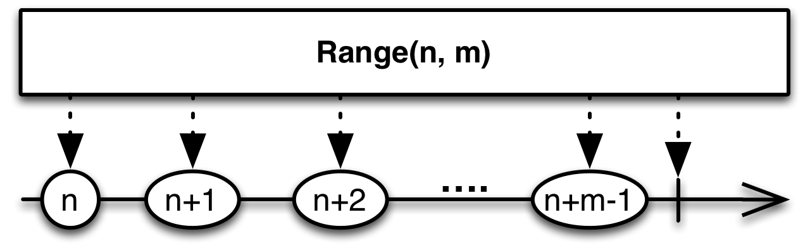

# ActionInRxJava

学习RxJava主要先了解以下几个概念

我们使用RxJava3    

http://reactivex.io/documentation/operators.html#creating

了解了具体功能，或许可以看下以下应用方式：

https://github.com/kaushikgopal/RxJava-Android-Samples

https://www.jianshu.com/p/c935d0860186

https://www.jianshu.com/p/fd82d18994ce

https://www.runoob.com/w3cnote/android-tutorial-end.html


## 第一部分 创建Observable

创建被观察者有如下方法：

### 1. create


create an Observable from scratch by calling observer methods programmatically

通过调用观察者方法从头创建Observable。

```Java
Observable.create(new Observable.OnSubscribe<Integer>() {
    @Override
    public void call(Subscriber<? super Integer> observer) {
        try {
            if (!observer.isUnsubscribed()) {
                for (int i = 1; i < 5; i++) {
                    observer.onNext(i);
                }
                observer.onCompleted();
            }
        } catch (Exception e) {
            observer.onError(e);
        }
    }
 } ).subscribe(new Subscriber<Integer>() {
        @Override
        public void onNext(Integer item) {
            System.out.println("Next: " + item);
        }

        @Override
        public void onError(Throwable error) {
            System.err.println("Error: " + error.getMessage());
        }

        @Override
        public void onCompleted() {
            System.out.println("Sequence complete.");
        }
    });
```

以上是RxJava1提供的代码示例，create内部的是被观察者，在其call方法内部调用传入的观察者的onNext、onError、onComplete回调方法来将对应事件发送给观察者。subscribe内部的是观察者对象的实现，主要实现前面三个回调方法。这样的实现方案有个弊端，不论观察者是否关心全部回调方法，观察者必须实现。而且onComplete和onError其实只会有一个方法会被回调。现实情况可能我们只关心onNext+onError，甚至只关心onNext。 从RxJava2开始，create方法的设计更灵活，可以指定要监听哪些事件。

```java
 Observable.create(new ObservableOnSubscribe<String>() {
            @Override
            public void subscribe(@NonNull ObservableEmitter<String> emitter) throws Throwable {
                try {
                    for (int i = 0; i < 10; i++) {
                        if (!emitter.isDisposed()) {
                            emitter.onNext(i + "测试create");
                        }
                    }
                } catch (Exception e) {
                    emitter.onError(e);
                }
                emitter.onComplete();
            }
        }).subscribe(new Consumer<String>() {
            @Override
            public void accept(String s) throws Throwable {
                System.out.println("onNext:" + s);
            }
        }, new Consumer<Throwable>() {
            @Override
            public void accept(Throwable throwable) throws Throwable {
                System.out.println("onError:" + throwable.getMessage());
            }
        }, new Action() {
            @Override
            public void run() throws Throwable {
                System.out.println("onComplete:");
            }
        });
```

以上就是RxJava3中create的用法，create中传入的是一个ObservableOnSubscribe对象，其中emitter 扮演了之前observer的角色，用于发射事件。subscribe方法中传递的是两个Consumer对象和一个Action对象，分别对应onNext、onError、onComplete。 从代码长度上来看好像和之前一样繁琐，但RxJava3支持Java 8，我们可以基于Java8的Lambda表达式特性来优化方法调用过程中的匿名内部类。

```java
private static void testCreate1() {
        Observable.create(emitter -> {
            try {
                for (int i = 0; i < 10; i++) {
                    if (!emitter.isDisposed()) {
                        emitter.onNext(i + "测试create");
                    }
                }
            } catch (Exception e) {
                emitter.onError(e);
            }
            emitter.onComplete();
        }).subscribe(
                s -> System.out.println("onNext:" + s),
                throwable -> System.out.println("onError:" + throwable.getMessage()),
                ()-> System.out.println("onComplete:")
        );
    }
```

是不是瞬间感觉少了很多模板代码，代码量减少一半。如果观察者不关心异常事件，我们可以只订阅onNext事件，代码如下：

```java
private static void testCreate2() {
        Observable.create(emitter -> {
            for (int i = 0; i < 10; i++) {
                if (!emitter.isDisposed()) {
                    emitter.onNext(i + "测试create");
                }
            }
        }).subscribe(s -> System.out.println("onNext:" + s));
    }
```

### 2. defer


do not create the Observable until the observer subscribes, and create a fresh Observable for each observer

defer是推迟和延期的意思，deffer延期创建被观察者对象，会在subscribe方法调用的时候创建被观察者对象，每次订阅都会创建新的被观察者对象。

上面图片中方框内的是事件发送流，非方框的是事件接收流，可以看出第一个观察者接收了红色事件队列，被观察者已经complete了。第二个观察者订阅的已经是绿色事件流了。

```java
private static void testDefer() {
        List<String> arrayList = new ArrayList<>();
        for (int i = 0; i < 10; i++) {
            arrayList.add(i + "defer item");
        }
        //创建observable
        Observable<String> observable = Observable.defer(new Supplier<ObservableSource<? extends String>>() {
            @Override
            public ObservableSource<? extends String> get() throws Throwable {
                System.out.println(System.currentTimeMillis()+" create Observable" );
                return new ObservableSource<String>() {
                    @Override
                    public void subscribe(@NonNull Observer<? super String> observer) {
                        for (String item : arrayList) {
                            observer.onNext(item);
                        }
                        observer.onComplete();
                    }
                };
            }
        });

        //处理数据时间
        for (int i = 10; i < 20; i++) {
            try {
                Thread.sleep(1000);
                arrayList.add(i + "defer item");
            } catch (InterruptedException e) {
                e.printStackTrace();
            }
        }

        //开始订阅
        System.out.println(System.currentTimeMillis()+" start subscribe" );
        observable.subscribe(new Consumer<String>() {
            @Override
            public void accept(String s) throws Throwable {
                System.out.println(System.currentTimeMillis() + " 收到事件:" + s);
            }
        });
    }
```

上面的代码中虽然创建被观察者的代码在前，但其get方法直到底下subscribe运行之后才执行 。而且 每次订阅都会由get方法创建新的ObservableSource实例。

同样我们使用Lambda表达式优化一下代码，可以精简结构。

```java
 private static void testDefer1() {
        List<String> arrayList = new ArrayList<>();
        for (int i = 0; i < 10; i++) {
            arrayList.add(i + "defer item");
        }
        //创建observable
        Observable<String> observable = Observable.defer(() -> {
            System.out.println(System.currentTimeMillis() + " create Observable");
            return observer -> arrayList.forEach(item -> observer.onNext(item));
        });
        //处理数据时间
        for (int i = 10; i < 20; i++) {
            try {
                Thread.sleep(1000);
                arrayList.add(i + "defer item");
            } catch (InterruptedException e) {
                e.printStackTrace();
            }
        }
        //开始订阅
        System.out.println(System.currentTimeMillis() + " start subscribe");
        observable.subscribe(s ->  System.out.println(System.currentTimeMillis() + " 收到事件:" + s));
    }
```

通过以上代码可以将被观察者的部分和观察者部分精简到三行，

### 3.  just


The Just operator converts an item into an Observable that emits that item.

前面我们通过create和defer将数据源生成observable对象，手动调用回调方法发射事件，just可以直接完成这样的功能。

```
    private static void testJust(){
        Observable.just(1,2,3,4,5,6)
                .subscribe(new Consumer<Integer>() {
                    @Override
                    public void accept(Integer integer) throws Throwable {
                        System.out.println("接收到item："+integer);
                    }
                });
        Observable.just(1,2,3,4,5,6).subscribe(i-> System.out.println("接收到item"+i));
    }
```

上面的代码通过just 直接生成Observable对象并发射next 事件，观察者可以直接处理收到的事件对象。


### 4.  from

rxjava3中from方法演变成多种特殊类型的方法，下面挑几个示例讲解下

```java
 private static void testFrom() {
        List<Integer> testdata = new ArrayList<>();
        for (int i = 0; i < 1000; i++) {
            testdata.add(i);
        }
        Observable.fromIterable(testdata)
                .subscribe(new Consumer<Integer>() {
                    @Override
                    public void accept(Integer integer) throws Throwable {
                        System.out.println("from:"+integer);
                    }
                });
        Observable.fromArray(1,23,3,4,5)
                .subscribe(integer -> System.out.println(integer));
    }
```

**fromIterable** 和 **fromArray**类似，都是将可迭代集合中的元素依次发射出去。

```java
 Observable.fromRunnable(() -> {
                    System.out.println("runrunrun");
                    try {
                        Thread.sleep(5000);
                    } catch (InterruptedException e) {
                        e.printStackTrace();
                    }
                }
        ).subscribe(null,
                e -> System.out.println("error:" + e),
                () -> System.out.println("complete"));
```

**fromRunnable**会在观察者中执行一个线程任务，线程任务结束会发射onComplete事件，或者因异常中断发射onError事件。有时候我们不关心一个子任务过程中的数据，只关心什么时候结束或者发生异常了，可以用这个方法。类似的还有**fromAction**底层实现基本上是一样的，我们这里没有切换线程，都是在主线程。

```java
  Observable.fromAction(new Action() {
            @Override
            public void run() throws Throwable {
                System.out.println(Thread.currentThread().getName());
                Thread.sleep(5000);
            }
        }).subscribe(s->{},s-> System.out.println("errror"),()-> {System.out.println(Thread.currentThread().getName());});
```

### 5. empty/never/error


empty   create an Observable that emits no items but terminates normally  不发射任何数据只调用complete。


never  create an Observable that emits no items and does not terminate 只会调用onSubscribe 方法，其他方法不会调用。


create an Observable that emits no items and terminates with an error 抛出异常并调用onError方法。


```java
public static void testEmptyNeverThrow() {
        Observer observer = new Observer() {
            @Override
            public void onSubscribe(@NonNull Disposable d) {
                System.out.println("订阅:" + d);// 每个订阅都会调用该方法。
            }

            @Override
            public void onNext(@NonNull Object o) {
                System.out.println("onNext:" + o);
            }

            @Override
            public void onError(@NonNull Throwable e) {
                System.out.println("onError:" + e);
            }

            @Override
            public void onComplete() {
                System.out.println("onComplete：");
            }
        };
        Observable.empty().subscribe(observer);
        Observable.never().subscribe(observer);
        Observable.error(new NullPointerException()).subscribe(observer);
        Observable.error(new Supplier<Throwable>() {
            @Override
            public Throwable get() throws Throwable {
                return new Exception("ddd");
            }
        }).subscribe(observer);
    }
```

​	

### 6. interval


create an Observable that emits a sequence of integers spaced by a given time interval

Interval 是一个定时器，按顺序定期发射一个Long型整数，我们可以在订阅者的onNext中执行我们想要的逻辑。

需要注意的是iterval 默认执行在计算线程，我们切换回当前前线程执行Schedulers.trampoline()

`interval` operates by default on the `computation` [Scheduler](http://reactivex.io/documentation/scheduler.html). There are also variants that allow you to set the Scheduler by passing one in as a parameter.

```java
   Observable.interval(5, 5, TimeUnit.SECONDS)
                .observeOn(Schedulers.trampoline())
                .subscribe(l -> {
                    System.out.println(l);
                });
```


### 7. range



create an Observable that emits a particular range of sequential integers

range 创建了一个指定区间的整数序列，并按顺序发射，默认在当前线程执行。

```java
Observable.range(1,10).subscribe(i-> System.out.println(i));
Observable.intervalRange(1,2,1,5,TimeUnit.SECONDS,Schedulers.trampoline())
                .subscribe(i-> System.out.println(i));
```


### 8. repeat


The Repeat operator emits an item repeatedly. Some implementations of this operator allow you to repeat a sequence of items, and some permit you to limit the number of repetitions.

这个接口在RxJava3中已经移除。


### 9. timer


timer returns an Observable that emits a single number zero after a delay period you specify.

timer by default operates on the computation Scheduler, or you can override this by passing in a Scheduler as a final parameter.

timer 创建的被观察者对象会在指定事件间隔后发射0，默认运行在计算线程，可以手动切换。

```java
 Observable.timer(5, TimeUnit.SECONDS,Schedulers.trampoline()).subscribe(l -> System.out.println(l));
```


## 第二部分 Schedulers 调度器

在刚才的介绍中我们提到interval和timer 的被观察者运行在计算线程上，这里顺势介绍下调度器概念，上面介绍的几种观察者模型都是运行在当前前程中的，如果要想要实现多线程，可以使用调度器指定被观察者所在线程和观察者所在线程。


#### 1. 调度器类型

RxJava框架的Schedulers类提供了5种预设线程，另外也可以指定我们自己的调度器。

| 调度器类型                                | 效果                                                         |
| :---------------------------------------- | :----------------------------------------------------------- |
| Schedulers.computation( )                 | 用于计算任务，如事件循环或和回调处理，不要用于IO操作(IO操作请使用Schedulers.io)；默认线程数等于处理器的数量 |
| Schedulers.from(executor)                 | 使用指定的Executor作为调度器                                 |
| Schedulers.single( )                      | 拥有一个线程单例，所有的任务都在这一个线程中执行，当此线程中有任务执行时，其他任务将会按照先进先出的顺序依次执行 |
| [Schedulers.io](http://schedulers.io/)( ) | 用于IO密集型任务，如异步阻塞IO操作，这个调度器的线程池会根据需要增长；对于普通的计算任务，请使用Schedulers.computation()；[Schedulers.io]默认是一个CachedThreadScheduler，很像一个有线程缓存的新线程调度器 |
| Schedulers.newThread( )                   | 为每个任务创建一个新线程                                     |
| Schedulers.trampoline( )                  | 当其它排队的任务完成后，在当前线程排队开始执行               |

#### 2.  线程切换

被观察者所在线程

（1）可以通过构造被观察者的方法指定所在线程，比如interval和timer都可以指定调度器。

（2）使用subscribeOn（调度器）指定被观察者运行的线程。

观察者所在线程

（1）使用observeOn(调度器)指定观察者运行的线程。


## 第三部分 转换Observable

### 1. buffer


periodically gather items emitted by an Observable into bundles and emit these bundles rather than emitting the items one at a time

定期收集Observable的数据放进一个数据包裹，然后发射这些数据包裹，而不是一次发射一个值。

```java
Observable.range(1,100)
          .buffer(3)
          .subscribe(list-> System.out.println(list));
```

上面的代码中range是依次发射一个整数，到达buffer之后，每收集3个后打包成一个list再发送给观察者统一处理。

需要注意的是：如果buffer上面的被观察者队列中出现一个error，即便已经收集了2个item，也会丢弃掉前两个数据并立即调用订阅者onError回调。


`buffer(count, skip)` creates a new buffer starting with the first emitted item from the source Observable, and every `skip` items thereafter, and fills each buffer with `count` items: the initial item and `count-1` subsequent ones. It emits these buffers as `List`s. Depending on the values of `count` and `skip` these buffers may overlap (multiple buffers may contain the same item), or they may have gaps (where items emitted by the source Observable are not represented in any buffer).

skip指定了下次缓存的起始位置举例上次缓存起始位置跳过了几个。skip小于count会有部分数据重复发送，比如  count=5  skip=3     第一次缓存01234位元素 ，第二次缓存34567位元素，第三次缓存678910 号元素。  skip大于count会略过一些数据，比如count=2 skip=5 第一次缓存01，第二次缓存56，第三次缓存1011。

```java
 Observable.range(0,100)
                .buffer(5,3)
                .subscribe(list-> System.out.println(list));
```

上面的缓冲序列都需要buffer收集够指定数量的元素之后才会集中发送一次，如果原始数据来源不稳定，时间间隔有长有短，那有可能buffer中缓存的第一个元素要等很久才可以发射出去。  就像坐大巴车，坐满才发车，如果没坐满就都等着。如果人比较多那就坐满一辆立即发一辆，也不用等时间。


反压（backpressure）：被观察者发射数据的速度要比观察者处理数据的速度快，这个时候就得限制一下。

Buffer操作符可以将大量的数据序列缩减为较少的数据缓存序列，让它们更容易处理。例如，你可以按固定的时间间隔，定期关闭和发射来自一个爆发性Observable的数据缓存。这相当于一个缓冲区。这种情况类似于公交车，整点发车。

```java
Observable<List<Integer>> burstyBuffered = bursty.buffer(500, TimeUnit.MILLISECONDS);
```


### 2. map

transform the items emitted by an Observable by applying a function to each item


将一种item转换成另一种item，默认在当前线程执行该操作。

```java
        Observable.range(1,10)
                .map(new Function<Integer, String>() {
                    @Override
                    public String apply(Integer integer) throws Throwable {
                        return "第"+integer+"个数据";
                    }
                })
                .subscribe(s-> System.out.println(s));
```

上面我们将int转换成字符串再发送出来。

### 3. flatMap

transform the items emitted by an Observable into Observables, then flatten the emissions from those into a single Observable


flatMap将上游收到的一个Observable对象，经过指定转换方法，变成多个元素。下面的demo就是将字符串按","分隔。

```java
 Observable.just("测试,flatMap,","123,45")
                .flatMap(i->Observable.fromArray(i.split(",")))
                .subscribe(s-> System.out.println(s));
```

这里需要注意的是，flatMap之后不见得还是按以前的顺序发射，有可能是交错的发射。


### 4. groupBy

divide an Observable into a set of Observables that each emit a different subset of items from the original Observable


返回Observable的一个特殊子类`GroupedObservable`，实现了`GroupedObservable`接口的对象有一个额外的方法`getKey`，这个Key用于将数据分组到指定的Observable。在收到GroupedObservable<K, T>之后，可以根据分组标签对不同分组设置特定的观察者进行处理。

groupBy也默认运行在当前线程中。

```java
Observable.range(1,100)
                .groupBy(i->i%2)// 返回int类型的分组标签
                .subscribe(new Consumer<GroupedObservable<Integer, Integer>>() {
                    @Override
                    public void accept(GroupedObservable<Integer, Integer> integerIntegerGroupedObservable) throws Throwable {
                        if (integerIntegerGroupedObservable.getKey()==0){
                            integerIntegerGroupedObservable.subscribe(integer -> System.out.println("偶数："+integer));
                        }else {
                            integerIntegerGroupedObservable.subscribe(integer -> System.out.println("奇数："+integer));
                        }
                    }
                });

 Observable.range(1,100)
                .groupBy(new Function<Integer, String>() {
                    @Override
                    public String apply(Integer integer) throws Throwable {
                        if (integer%2==0){
                            return "aaa";// groupTag
                        }else {
                            return "bbb";
                        }
                    }
                })
                .subscribe(new Consumer<GroupedObservable<String, Integer>>() {
                    @Override
                    public void accept(GroupedObservable<String, Integer> stringIntegerGroupedObservable) throws Throwable {
                        String key = stringIntegerGroupedObservable.getKey();
                        switch (key){
                            case "aaa":
                                stringIntegerGroupedObservable.subscribe(i-> System.out.println("aaa:"+i));
                                break;
                            case "bbb":
                                stringIntegerGroupedObservable.subscribe(i-> System.out.println("bbb:"+i));
                                break;
                        }
                    }
                });

    }
```


### 5. scan


apply a function to each item emitted by an Observable, sequentially, and emit each successive value

scan操作符的主要作用是对传入的种子值和item 进行特定处理比如求合，返回的结果将作为下个item的种子值。

```java
Observable.range(1,20)
                .scan(10,new BiFunction<Integer, Integer, Integer>() {
                    @Override
                    public Integer apply(Integer integer, Integer integer2) throws Throwable {
                        System.out.println("a:"+integer+"b:"+integer2);
                        return integer+integer2;
                    }
                })
                .subscribe(integer -> {
                    System.out.println(integer);
                });
```

以上代码中10 作为初始种子值，即第一次运行apply方法时integer为10，integer2为1，返回的11将作为下一个种子值。

如果没有设置初始种子值，将使用序列的第一个元素作为初始种子值，从第二个元素开始发射。


### 6. window

periodically subdivide items from an Observable into Observable windows and emit these windows rather than emitting the items one at a time


window将原始序列累积到一定数量后发射一个Observables，而buffer发射的时原始数据的list。

```java
Observable.range(1,50)
                .window(10)
                .subscribe(new Consumer<Observable<Integer>>() {
                    @Override
                    public void accept(Observable<Integer> integerObservable) throws Throwable {
                        System.out.println("窗口开始");
                        integerObservable.subscribe(integer -> System.out.println(integer));
                    }
                });
```


